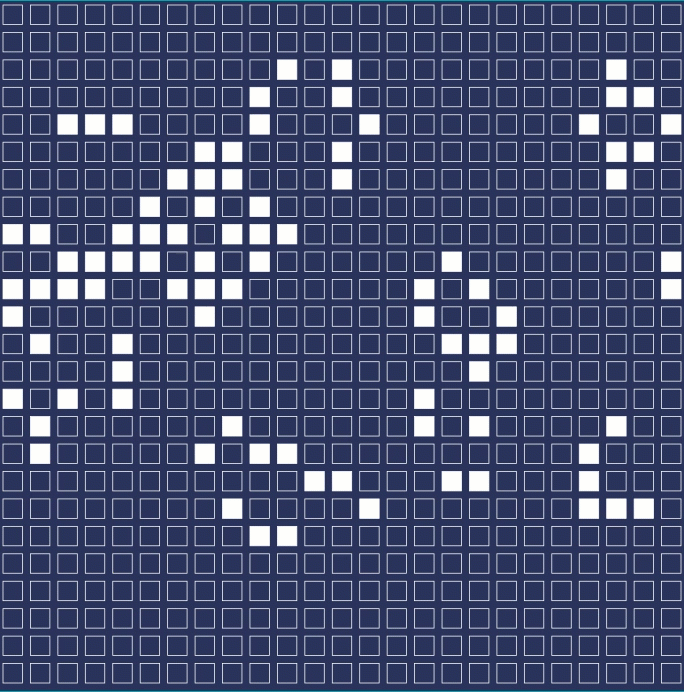

# Conway's Game of Life
## A GoLang and WASM Implementation

* Any live cell with fewer than two live neighbours dies, as if by underpopulation.
* Any live cell with two or three live neighbours lives on to the next generation.
* Any live cell with more than three live neighbours dies, as if by overpopulation.
* Any dead cell with exactly three live neighbours becomes a live cell, as if by reproduction.

## Running locally
You'll need to install [GoLang](https://golang.org/) and [Make](https://en.wikipedia.org/wiki/Make_%28software%29) first. Clone the project locally and then perform a `make run`.

Open your browser to [localhost:4141](http://localhost:4141) to see the game play. You can add query parameters to adjust the `rows`, `columns`, and `seed`. For example [localhost:4141?rows=50&columns=50&seed=12345](http://localhost:4141?rows=50&columns=50&seed=12345)